<div align="center">

**🌐 Language:** &nbsp; **English** &nbsp;|&nbsp; [🇻🇳 Tiếng Việt](./README.vi.md)

# 🏥 HISDashboard

### AI-Powered Hospital Management System


*Full-stack hospital dashboard integrating AI agents, automated reporting, and real-time analytics — connected directly to a Hospital Information System (Oracle HIS).*

**🔒 Source code is private** (enterprise healthcare project). This repository showcases the architecture, technical decisions, and engineering capabilities behind the system.

[Architecture](#%EF%B8%8F-system-architecture) · [AI Agents](#-ai-agent-system) · [Technical Decisions](#-key-technical-decisions) · [Screenshots](#-screenshots) · [Documentation](./docs/)

</div>

---

## 📋 Project Context

| | |
|---|---|
| **Client** | A Hospital in Vietnam |
| **Type** | Enterprise Healthcare IT — Internal Operations Dashboard |
| **Users** | Hospital staff (doctors, nurses, administrators, finance team) |
| **Status** | ✅ Production — serving daily |
| **Duration** | 8+ months active development |

### What it does

HISDashboard replaces manual Excel-based hospital reporting with an **AI-powered real-time dashboard** that:

1. **Connects to Oracle HIS** — Reads patient, billing, and operational data from the hospital's core system (read-only)
2. **Provides 12 feature modules** — Financial reports, HR management, customer care, KPI planning, supplies
3. **Runs 10 AI agents** — Automated analysis, anomaly detection, revenue forecasting
4. **Delivers reports automatically** — Via Telegram and Zalo bots on scheduled times
5. **Maintains a knowledge base** — RAG-powered search over hospital SOPs and medical guidelines

---

## 📊 System Metrics

<table>
<tr>
<td width="50%">

### Backend Scale

| Component | Count |
|---|---|
| API Endpoints | **292** (across 237 paths) |
| API Routers | **37** |
| Backend Services | **44** (33 core + 11 report) |
| ORM Models | **31** |
| Pydantic Schemas | **25+** |
| Scheduled Jobs | **10** (backend) |
| Middleware | **3** (CORS, Auth, Activity Tracker) |

</td>
<td width="50%">

### AI & Infrastructure

| Component | Count |
|---|---|
| AI Agents | **10** (ReAct + Router + Reflection) |
| LLM Providers | **4** (OpenRouter, Gemini, Groq, Ollama) |
| AI Tools | **40+** (across 12 files) |
| RAG Pipeline | ChromaDB + Hybrid Search |
| Bot Platforms | **2** (Telegram + Zalo) |
| Docker Services | **6** |
| Databases | **3** (MySQL + Oracle + Redis) |

</td>
</tr>
</table>

---

## 🏗️ System Architecture

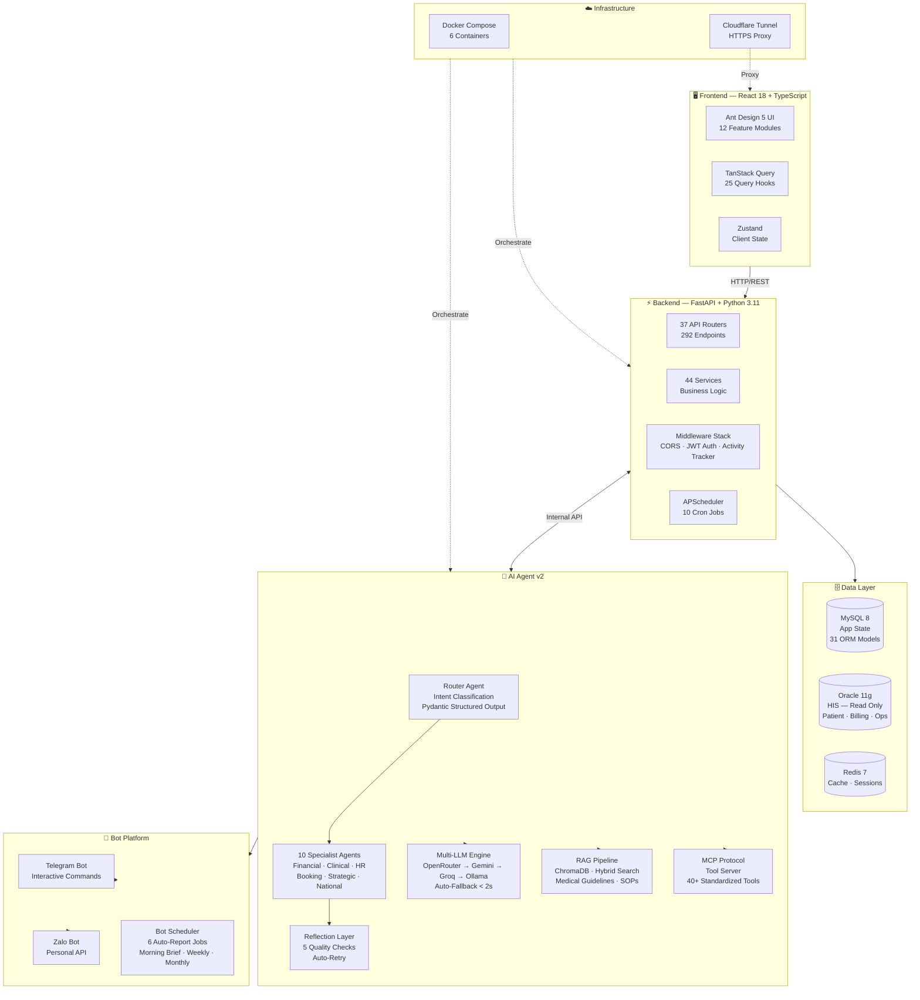

> 📄 Detailed architecture documentation: [docs/architecture.md](./docs/architecture.md)

---

## 🤖 AI Agent System

### Architecture: Router → Specialist → Reflection

```
User Message
    ↓
┌─────────────────┐
│  Router Agent    │  Classifies intent using LLM structured output
│  3-layer fallback│  LLM → Text Parse → Keyword Regex
│  Confidence score│  < 0.4 → asks user to clarify
└────────┬────────┘
         ↓
┌─────────────────────────────────────────┐
│  Specialist Agent (1 of 10)             │
│                                         │
│  FinancialAnalyst  │  ClinicalAgent     │
│  HospitalAnalyst   │  BookingAgent      │
│  StrategicPlanner  │  ReminderAgent     │
│  NationalHealth    │  GeneralAssistant  │
│  HRDispatch        │  TrainingAdvisor   │
│                                         │
│  Each agent has:                        │
│  • Focused toolkit (2-20 tools)         │
│  • Right-sized model (simple/complex)   │
│  • Calibrated iterations (3-10)         │
└────────┬────────────────────────────────┘
         ↓
┌─────────────────┐
│  Reflection      │  5 quality checks before responding:
│  Layer           │  • Empty/Short response
│                  │  • Tool call failures
│  Quality ≥ 0.4   │  • Ungrounded medical claims
│  → Send          │  • Repetition loops
│  Quality < 0.4   │  • Generic non-answers
│  → Auto-retry    │
└────────┬────────┘
         ↓
    ✅ User Response
```

### Multi-LLM Fallback Chain

```
Primary:    OpenRouter (DeepSeek-V4)    ← Best cost/performance
    ↓ 429 / timeout
Fallback 1: Google Gemini               ← Free tier, solid quality
    ↓ quota exhausted
Fallback 2: Groq                        ← Fastest inference
    ↓ all cloud down
Fallback 3: Ollama (local)              ← On-premise, always available

Failover time: < 2 seconds
API key rotation: automatic on 429 errors
```

### Tools by Domain

| Domain | Tools | Examples |
|---|---|---|
| Financial Analytics | 8 | Revenue trend, Insurance summary, Period comparison |
| Diagnostic | 3 | Revenue driver analysis, Anomaly detection, Benchmarking |
| Predictive | 2 | Revenue forecast, Scenario simulation |
| HR | 4 | Workload analysis, Staff reallocation, Doctor KPI, Training programs |
| Clinical | 4 | Patient lookup, Medical guidelines (RAG), Drug info (RAG) |
| National Health | 4 | National benchmarks, Hospital vs National comparison |
| Operations | 5 | Dashboard summary, Appointment management, Reminders |
| Knowledge Base | 2 | Hospital SOP search, Knowledge stats |

> 📄 Detailed AI agent documentation: [docs/ai-agent-design.md](./docs/ai-agent-design.md)

---

## ⚡ Key Technical Decisions

### 1. Multi-LLM vs Single-LLM

| | Single-LLM | Multi-LLM (chosen) |
|---|---|---|
| **Reliability** | ❌ Provider down = AI offline | ✅ Auto-fallback < 2s |
| **Cost** | Fixed | ✅ Route cheap/complex dynamically |
| **Complexity** | Simple | More setup |
| **Result** | 3 failed reports/week | **0 failures/month** |

### 2. Dual Database (MySQL + Oracle)

| Concern | Decision |
|---|---|
| **Problem** | Hospital data lives in Oracle HIS — a core system with no write access |
| **Solution** | MySQL for app state + Oracle read-only for HIS data |
| **Sync** | Nightly billing sync Oracle → MySQL to reduce query load |
| **Result** | Clean separation, no risk to hospital core system |

### 3. Router + Specialist Agents (not One God-Agent)

| Concern | Decision |
|---|---|
| **Problem** | 40+ tools in one agent = context overflow + wrong tool selection |
| **Solution** | Router classifies intent → routes to specialized agent with 2-20 focused tools |
| **Cost saving** | Simple tasks use cheap models, complex use expensive → **60% cost reduction** |
| **Result** | Routing accuracy ~60% → **~92%**, response time 8-15s → **3-6s** |

### 4. MCP Protocol for Tool Communication

| Concern | Decision |
|---|---|
| **Problem** | 40+ tools across 12 files with inconsistent interfaces |
| **Solution** | Model Context Protocol — one schema, one discovery mechanism |
| **Benefit** | Add new tools without agent code changes |

### 5. Snapshot + Cache Strategy

| Concern | Decision |
|---|---|
| **Problem** | Oracle HIS queries for financial reports: 5-15 seconds/query |
| **Solution** | Daily snapshot at 23:30 + Cache warmup every 30 min during business hours |
| **Result** | Dashboard loads **< 1 second** for most reports |

> 📄 Deep-dive with trade-off analysis: [docs/technical-decisions.md](./docs/technical-decisions.md)

---

## 📱 Feature Modules

| Module | Description | Highlights |
|---|---|---|
| 📊 **Financial Reports** | Department revenue, Insurance, CFO KPIs | Oracle HIS real-time data |
| 👥 **HR Management** | Staff, Schedules, Leaves, Tasks, Handovers | 70+ dedicated endpoints |
| 💬 **Customer Care** | Discharged patient CRM, Doctor Notes | Follow-up tracking |
| 🎯 **KPI Planning** | Tree-Grid dashboard, Excel Import/Export | Target vs Actual tracking |
| 🤖 **AI Analytics** | Anomaly Detection, Revenue Analysis | Multi-LLM powered |
| 📱 **Bot Platform** | Telegram + Zalo auto-reports | AI-generated summaries |
| 🏥 **Supplies** | Inpatient supplies, Department groups | Category management |
| 🔔 **Notifications** | Real-time Notification Center | In-app alerts |
| 🛡️ **Administration** | RBAC, Activity Logs, DB Backup | Role-based access |
| 📈 **Competency** | Staff competency matrix, Gap analysis | Training recommendations |
| 📋 **Report Catalog** | Dynamic report management system | Admin-configurable |
| 💬 **Chat** | Internal messaging system | Task assignment |

---

## ⏰ Automated Jobs

### Backend Scheduler (10 jobs)

| Job | Schedule | Purpose |
|---|---|---|
| Daily Financial Snapshot | 23:30 | End-of-day data capture |
| Cache Warmup | Every 30min (7h-17h) | Pre-compute Oracle queries |
| Anomaly Scan | 5x daily | Revenue anomaly detection |
| Oracle Health Check | Every 5min | Connection pool monitoring |
| Billing Sync (Daily) | 01:00 | Oracle → MySQL (1 month window) |
| Billing Sync (Weekly) | 02:00 Sunday | Oracle → MySQL (3 month window) |
| Activity Logs Cleanup | 03:00 | Retain policy enforcement |

### AI Agent Scheduler (6 jobs)

| Job | Schedule | Purpose |
|---|---|---|
| Morning Brief | 07:15 Mon-Sat | AI summary → Telegram |
| Weekly Review | 20:00 Sunday | LLM weekly analysis |
| Monthly Deep Dive | 1st of month | 10-section deep analysis |
| KPI Alerts | Hourly (8h-17h) | Threshold monitoring |
| Appointment Notifications | Every 1 min | Upcoming appointment alerts |
| Reminders | Every 1 min | Due date tracking |

---

## 🖼️ Screenshots

> All screenshots use production data from a live hospital environment (sanitized where necessary).

### 📊 Dashboard & Analytics

| | |
|---|---|
| 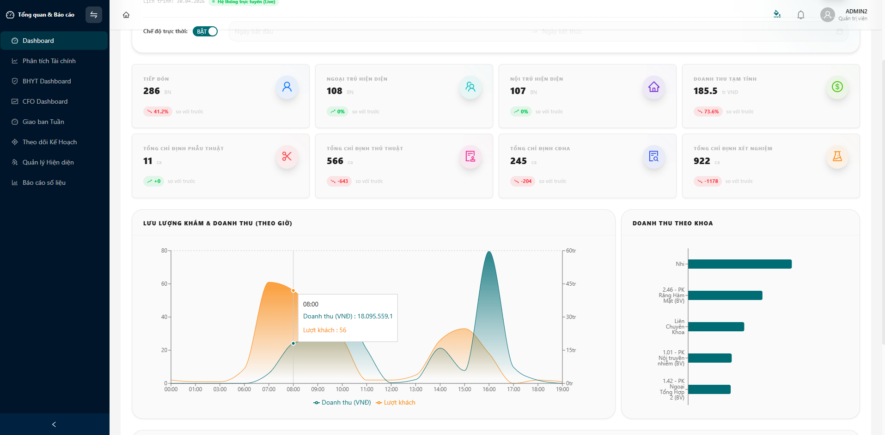 | 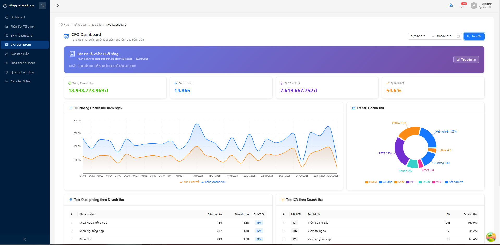 |
| **Real-time Operations Dashboard** — Patient stats, hourly revenue trends, department comparison | **CFO Financial Dashboard** — AI-generated morning brief, revenue trends, ICD analysis |
| 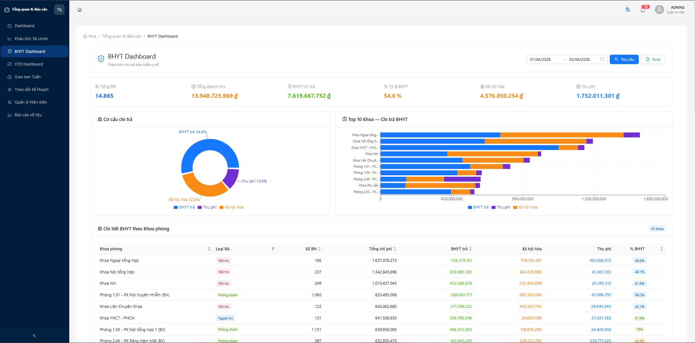 | 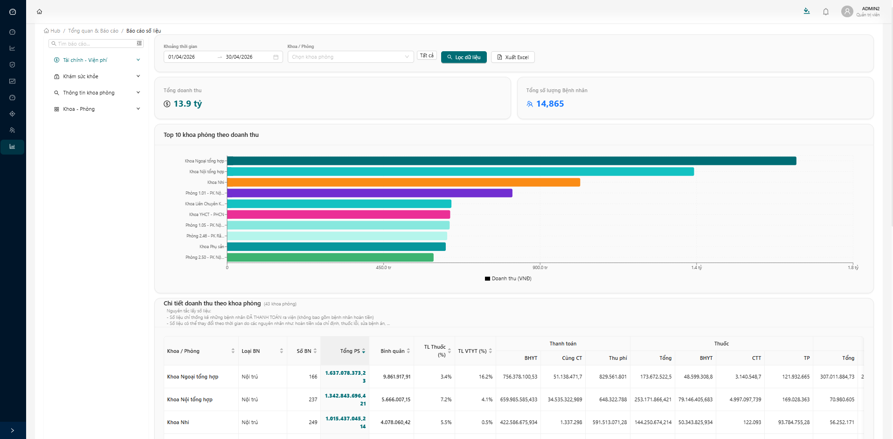 |
| **Insurance (BHYT) Analysis** — Payment breakdown by department, co-pay ratios | **Revenue Reports** — Top 10 departments, detailed billing with BHYT/co-pay split |

### 🎯 KPI & Planning

| |
|---|
| 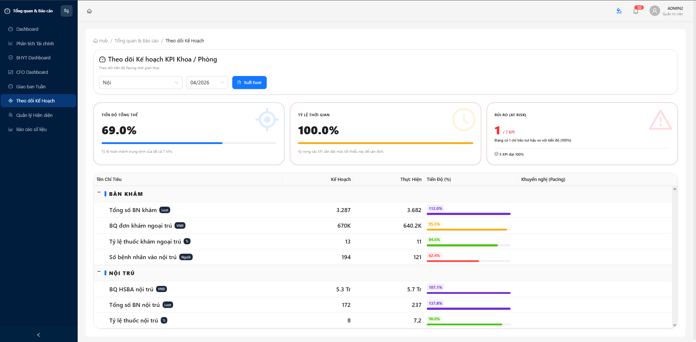 |
| **KPI Tracking Dashboard** — Progress tracking with pacing recommendations, risk alerts, target vs actual comparison |

### 👥 HR & Operations

| | |
|---|---|
| 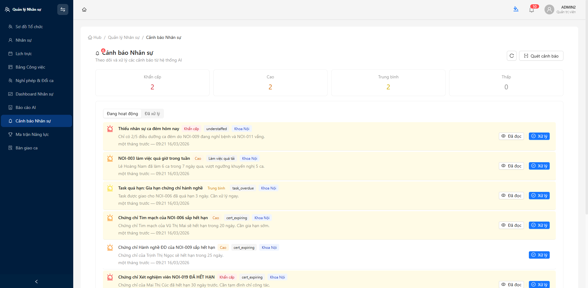 | 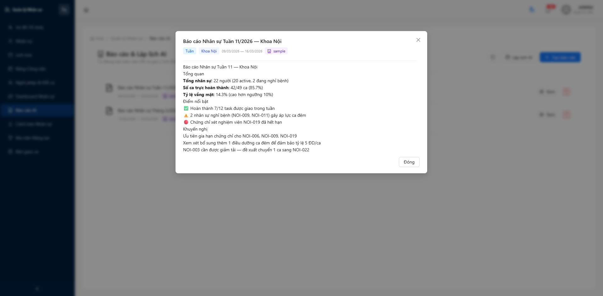 |
| **AI-Powered HR Alerts** — Understaffing warnings, certificate expiry tracking, workload alerts | **AI HR Report** — Weekly department summary with actionable recommendations |

### 🤖 AI Agent & Bot Platform

| | |
|---|---|
| 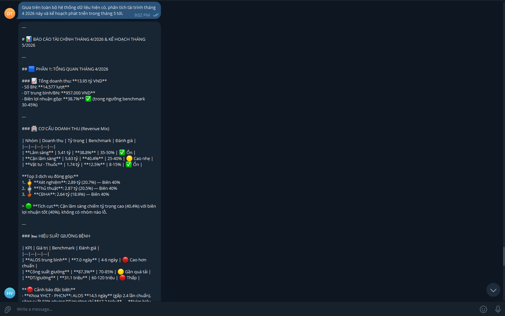 | 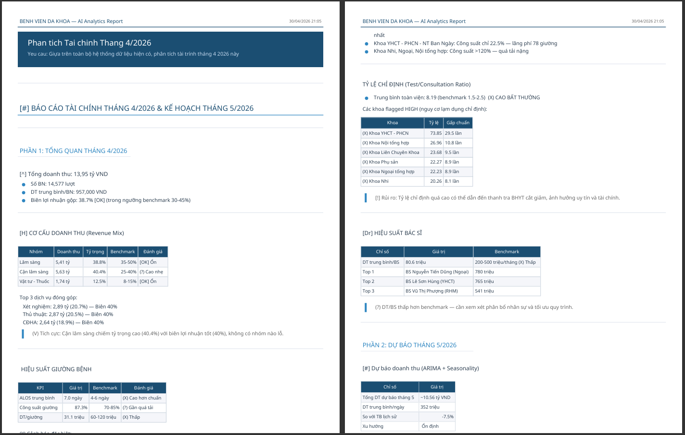 |
| **Telegram Bot — Interactive AI Analysis** — Natural language query, structured financial report with benchmarks | **AI-Generated PDF Report** — Multi-page analytics document with KPIs, revenue mix, forecasting |

### 📱 Mobile Experience & CRM

| | |
|---|---|
| 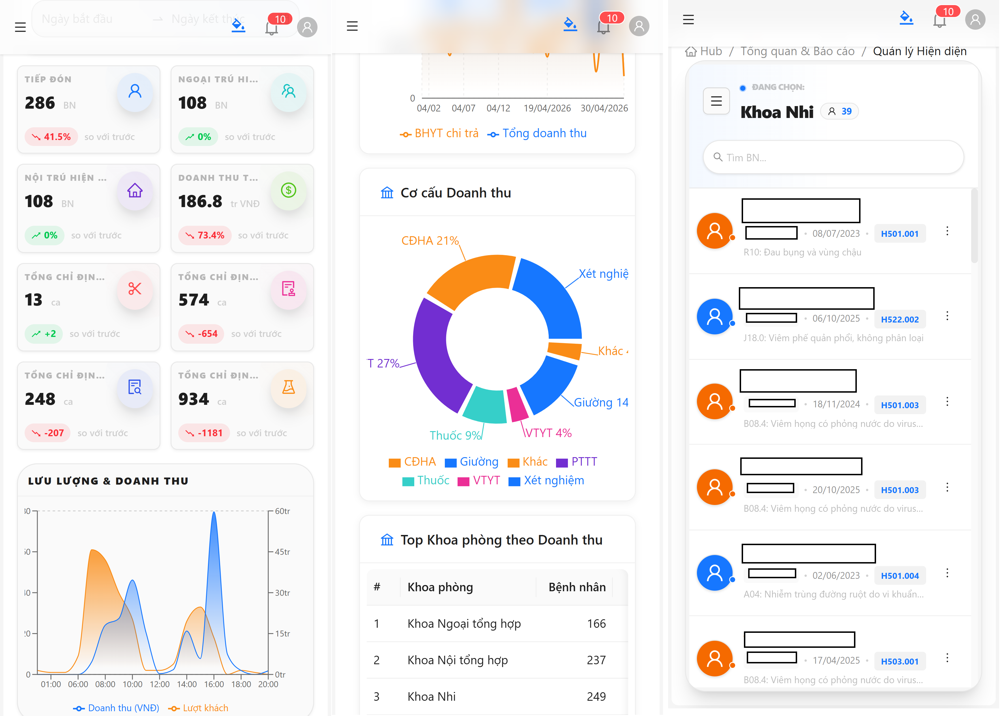 | 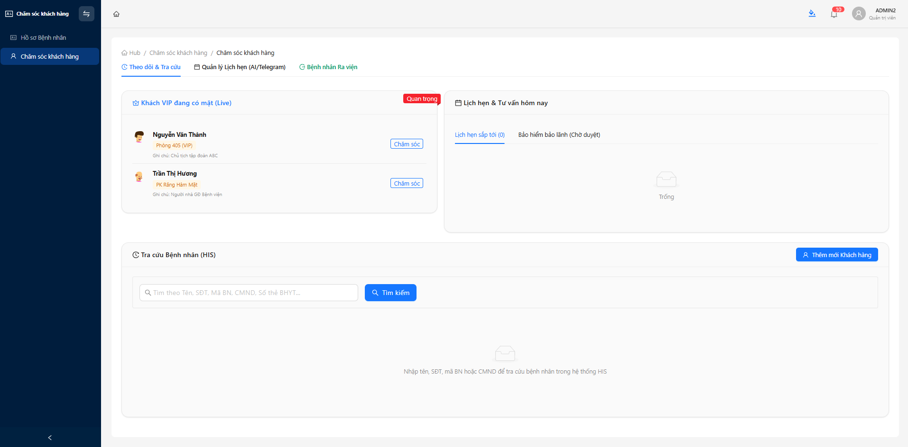 |
| **Mobile-Optimized Interface** — Fully responsive design, quick patient lookup, real-time metrics | **Customer Care CRM** — VIP patient tracking, appointment follow-ups, doctor notes |

### 🛡️ Administration

| | |
|---|---|
| 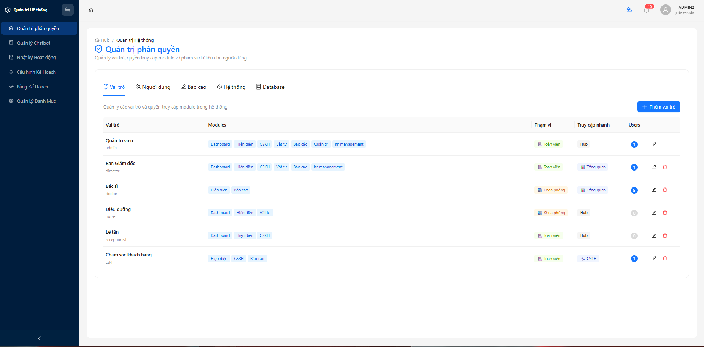 | 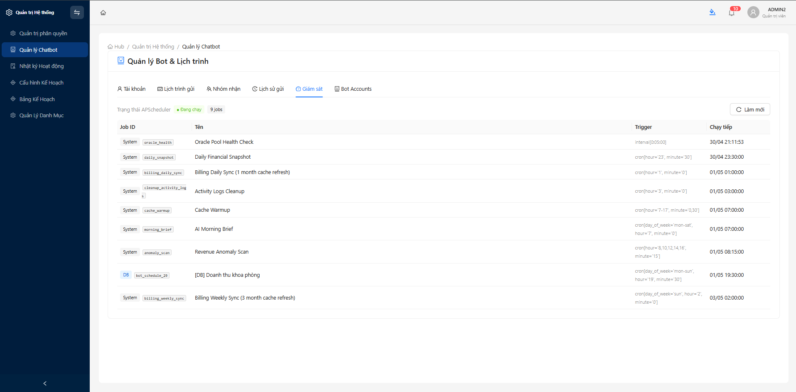 |
| **Role-Based Access Control** — 6 roles, module-level permissions, scope-based data access | **Bot & Scheduler Management** — 9 automated jobs, APScheduler monitoring, cron configuration |

---

## 🎥 Demo Video

> 🎬 *Coming soon — A 3-minute walkthrough: Dashboard → Reports → AI Agent → Bot*

---

## 🛠️ Tech Stack

| Layer | Technologies |
|---|---|
| **Frontend** | React 18 · TypeScript · Vite · Ant Design 5 · TailwindCSS v4 · Zustand · TanStack Query |
| **Backend** | Python 3.11 · FastAPI · SQLAlchemy 2.0 · Pydantic v2 · APScheduler |
| **Database** | MySQL 8 (app) · Oracle 11g (HIS read-only) · Redis 7 (cache) |
| **AI Agent** | AgentScope · ReAct Pattern · Multi-LLM · MCP Protocol |
| **RAG** | ChromaDB · Hybrid Search (dense + sparse) · Document Ingestion |
| **Auth** | JWT (HS256) · RBAC (admin / editor / viewer) |
| **Bot** | Telegram Bot API · Zalo Personal API (zlapi) |
| **Infra** | Docker Compose (6 services) · Cloudflare Tunnel · GitHub Actions |

---

## 📚 Documentation

| Document | Description |
|---|---|
| 🏗️ [Architecture](./docs/architecture.md) | System design, data flow, component interaction |
| 🤖 [AI Agent Design](./docs/ai-agent-design.md) | Agent patterns, tool design, multi-LLM strategy |
| ⚡ [Technical Decisions](./docs/technical-decisions.md) | Trade-off analysis for 5 key decisions |

---

## 👤 About the Author

I'm **Duc Thanh**, an AI Engineer specializing in Healthcare IT. I design and build production AI systems that hospitals use daily.

- 🔗 [GitHub Profile](https://github.com/ducthanh1810)
- 💼 [LinkedIn](https://www.linkedin.com/in/ducthanh1810)
- 📝 [Blog](https://dev.to/ducthanh1810)

### Related Open Source Projects

| Project | Description |
|---|---|
| [healthcare-mcp-server](https://github.com/ducthanh1810/healthcare-mcp-server) | MCP tool server for healthcare data (MIT License) |
| [ai-agent-starter](https://github.com/ducthanh1810/ai-agent-starter) | Template for building production AI agents (coming soon) |

---

<div align="center">

*This is a showcase repository. Source code is private due to enterprise healthcare requirements.*
*Architecture, decisions, and capabilities are fully documented above.*

**© 2026 Duc Thanh** · Built for a Hospital in Vietnam

</div>
