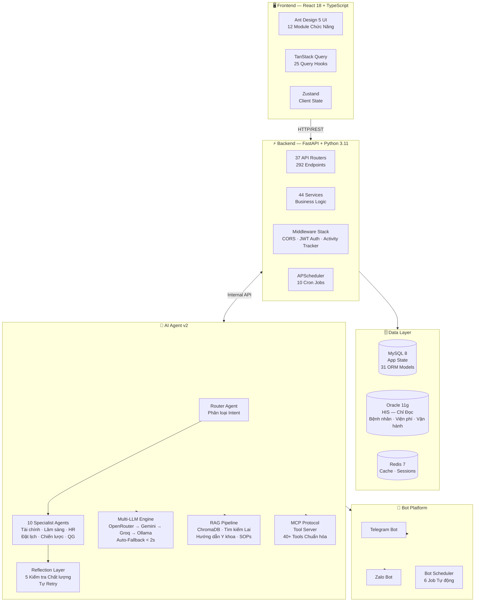

<div align="center">

**🌐 Language:** &nbsp; [🇺🇸 English](./README.md) &nbsp;|&nbsp; **Tiếng Việt**

# 🏥 HISDashboard

### Hệ Thống Quản Lý Bệnh Viện Tích Hợp AI


*Dashboard bệnh viện full-stack tích hợp AI agent, báo cáo tự động, và phân tích thời gian thực — kết nối trực tiếp hệ thống thông tin bệnh viện (Oracle HIS).*

**🔒 Mã nguồn bảo mật** (dự án doanh nghiệp y tế). Repository này trình bày kiến trúc, quyết định kỹ thuật và năng lực kỹ thuật đằng sau hệ thống.

[Kiến trúc](#%EF%B8%8F-kiến-trúc-hệ-thống) · [AI Agents](#-hệ-thống-ai-agent) · [Quyết định kỹ thuật](#-quyết-định-kỹ-thuật-quan-trọng) · [Screenshots](#-ảnh-chụp-màn-hình) · [Tài liệu](./docs/)

</div>

---

## 📋 Bối Cảnh Dự Án

| | |
|---|---|
| **Khách hàng** | Một bệnh viện tại Việt Nam |
| **Loại** | Enterprise Healthcare IT — Dashboard vận hành nội bộ |
| **Người dùng** | Nhân viên bệnh viện (bác sĩ, điều dưỡng, quản trị, tài chính) |
| **Trạng thái** | ✅ Production — phục vụ hàng ngày |
| **Thời gian** | 8+ tháng phát triển |

### Hệ thống làm gì

HISDashboard thay thế quy trình báo cáo Excel thủ công bằng **dashboard thời gian thực tích hợp AI**:

1. **Kết nối Oracle HIS** — Đọc dữ liệu bệnh nhân, viện phí, vận hành từ hệ thống lõi (chỉ đọc)
2. **12 module chức năng** — Báo cáo tài chính, quản lý nhân sự, CSKH, KPI, vật tư
3. **10 AI agents** — Phân tích tự động, phát hiện bất thường, dự báo doanh thu
4. **Báo cáo tự động** — Gửi qua Telegram và Zalo bot theo lịch hẹn
5. **Cơ sở tri thức** — Tìm kiếm RAG trên SOP bệnh viện và hướng dẫn y khoa

---

## 📊 Số Liệu Hệ Thống

<table>
<tr>
<td width="50%">

### Quy Mô Backend

| Thành phần | Số lượng |
|---|---|
| API Endpoints | **292** (trên 237 paths) |
| API Routers | **37** |
| Backend Services | **44** (33 core + 11 báo cáo) |
| ORM Models | **31** |
| Pydantic Schemas | **25+** |
| Scheduled Jobs | **10** (backend) |
| Middleware | **3** (CORS, Auth, Activity Tracker) |

</td>
<td width="50%">

### AI & Hạ Tầng

| Thành phần | Số lượng |
|---|---|
| AI Agents | **10** (ReAct + Router + Reflection) |
| Nhà cung cấp LLM | **4** (OpenRouter, Gemini, Groq, Ollama) |
| AI Tools | **40+** (trên 12 files) |
| RAG Pipeline | ChromaDB + Tìm kiếm Lai |
| Bot Platforms | **2** (Telegram + Zalo) |
| Docker Services | **6** |
| Databases | **3** (MySQL + Oracle + Redis) |

</td>
</tr>
</table>

---

## 🏗️ Kiến Trúc Hệ Thống



> 📄 Chi tiết kiến trúc: [docs/architecture.md](./docs/architecture.md)

---

## 🤖 Hệ Thống AI Agent

### Kiến trúc: Router → Specialist → Reflection

```
Tin nhắn người dùng
    ↓
┌─────────────────┐
│  Router Agent    │  Phân loại intent bằng LLM structured output
│  Fallback 3 lớp │  LLM → Parse text → Keyword Regex
│  Confidence      │  < 0.4 → yêu cầu làm rõ
└────────┬────────┘
         ↓
┌─────────────────────────────────────────┐
│  Specialist Agent (1 trong 10)          │
│                                         │
│  FinancialAnalyst  │  ClinicalAgent     │
│  HospitalAnalyst   │  BookingAgent      │
│  StrategicPlanner  │  ReminderAgent     │
│  NationalHealth    │  GeneralAssistant  │
│  HRDispatch        │  TrainingAdvisor   │
│                                         │
│  Mỗi agent có:                          │
│  • Toolkit tập trung (2-20 tools)       │
│  • Model phù hợp (đơn giản/phức tạp)   │
│  • Iterations tùy chỉnh (3-10)         │
└────────┬────────────────────────────────┘
         ↓
┌─────────────────┐
│  Reflection      │  5 kiểm tra trước khi phản hồi:
│  Layer           │  • Phản hồi rỗng/ngắn
│                  │  • Tool call thất bại
│  Chất lượng ≥0.4 │  • Tuyên bố y khoa không có nguồn
│  → Gửi          │  • Lặp vòng
│  < 0.4 → Retry  │  • Trả lời chung chung
└─────────────────┘
```

### Chuỗi Fallback Multi-LLM

```
Chính:      OpenRouter (DeepSeek-V4)    ← Tốt nhất chi phí/hiệu năng
    ↓ 429 / timeout
Fallback 1: Google Gemini               ← Free tier, chất lượng tốt
    ↓ hết quota
Fallback 2: Groq                        ← Inference nhanh nhất
    ↓ tất cả cloud down
Fallback 3: Ollama (local)              ← On-premise, luôn sẵn sàng

Thời gian chuyển: < 2 giây
```

> 📄 Chi tiết thiết kế AI Agent: [docs/ai-agent-design.md](./docs/ai-agent-design.md)

---

## ⚡ Quyết Định Kỹ Thuật Quan Trọng

| # | Quyết định | Lý do | Kết quả |
|---|---|---|---|
| 1 | **Multi-LLM** thay vì Single-LLM | BV hoạt động 24/7, không chấp nhận downtime | 0 báo cáo lỗi/tháng, giảm 56% chi phí |
| 2 | **Dual Database** (MySQL + Oracle) | Oracle HIS là hệ thống lõi, không được gây rủi ro | Tách biệt sạch, dashboard < 1 giây |
| 3 | **10 Agent chuyên biệt** thay vì 1 Agent | 40+ tools gây tràn context, chọn sai tool | Accuracy 60% → 92%, chi phí giảm 60% |
| 4 | **MCP Protocol** cho tool | 40+ tools cần giao diện thống nhất | Thêm tool mới không cần sửa agent |
| 5 | **Snapshot + Cache** | Query Oracle chậm 5-15s | Dashboard tải < 1 giây |

> 📄 Phân tích trade-off chi tiết: [docs/technical-decisions.md](./docs/technical-decisions.md)

---

## 🖼️ Ảnh Chụp Màn Hình

> Tất cả ảnh chụp từ hệ thống production bệnh viện thực tế (đã xử lý thông tin nhạy cảm khi cần thiết).

### 📊 Dashboard & Phân Tích

| | |
|---|---|
|  |  |
| **Dashboard Vận hành** — Thống kê bệnh nhân, xu hướng doanh thu theo giờ, so sánh khoa phòng | **Dashboard CFO** — Bản tin AI buổi sáng, xu hướng doanh thu, phân tích mã ICD |
|  |  |
| **Phân tích BHYT** — Tỷ lệ chi trả theo khoa, cơ cấu BHYT/thu phí/xã hội hóa | **Báo cáo Doanh thu** — Top 10 khoa phòng, chi tiết viện phí BHYT/đồng chi trả |

### 🎯 KPI & Kế Hoạch

| |
|---|
|  |
| **Theo dõi KPI** — Tiến độ thực hiện với khuyến nghị pacing, cảnh báo rủi ro, so sánh kế hoạch vs thực hiện |

### 👥 Nhân Sự & Vận Hành

| | |
|---|---|
|  |  |
| **Cảnh báo Nhân sự AI** — Thiếu nhân sự, hết hạn chứng chỉ, quá tải công việc | **Báo cáo AI Nhân sự** — Tổng kết tuần với khuyến nghị hành động |

### 🤖 AI Agent & Bot Platform

| | |
|---|---|
|  |  |
| **Telegram Bot — Phân tích AI** — Hỏi đáp tự nhiên, báo cáo tài chính có benchmark | **Báo cáo PDF do AI tạo** — Tài liệu phân tích nhiều trang với KPI, cơ cấu doanh thu, dự báo |

### 📱 Trải nghiệm Di động & CSKH

| | |
|---|---|
|  |  |
| **Giao diện Tối ưu Mobile** — Thiết kế responsive, tra cứu nhanh bệnh nhân, số liệu realtime | **CRM Chăm sóc Khách hàng** — Theo dõi bệnh nhân VIP, lịch hẹn, ghi chú của bác sĩ |

### 🛡️ Quản Trị Hệ Thống

| | |
|---|---|
|  |  |
| **Phân quyền truy cập** — 6 vai trò, phân quyền module, phạm vi dữ liệu theo khoa | **Quản lý Bot & Lịch trình** — 9 job tự động, giám sát APScheduler, cấu hình cron |

---

## 🎥 Demo Video

> 🎬 *Sắp ra mắt — Video 3 phút: Dashboard → Báo cáo → AI Agent → Bot*

---

## 🛠️ Công Nghệ

| Tầng | Công nghệ |
|---|---|
| **Frontend** | React 18 · TypeScript · Vite · Ant Design 5 · TailwindCSS v4 · Zustand · TanStack Query |
| **Backend** | Python 3.11 · FastAPI · SQLAlchemy 2.0 · Pydantic v2 · APScheduler |
| **Database** | MySQL 8 (app) · Oracle 11g (HIS chỉ đọc) · Redis 7 (cache) |
| **AI Agent** | AgentScope · ReAct Pattern · Multi-LLM · MCP Protocol |
| **RAG** | ChromaDB · Tìm kiếm Lai (dense + sparse) · Document Ingestion |
| **Auth** | JWT (HS256) · RBAC (admin / editor / viewer) |
| **Bot** | Telegram Bot API · Zalo Personal API (zlapi) |
| **Hạ tầng** | Docker Compose (6 services) · Cloudflare Tunnel · GitHub Actions |

---

## 👤 Về Tác Giả

Tôi là **Đức Thành**, AI Engineer chuyên về Healthcare IT. Tôi thiết kế và xây dựng hệ thống AI production mà bệnh viện sử dụng hàng ngày.

- 🔗 [GitHub Profile](https://github.com/ducthanh1810)
- 💼 [LinkedIn](https://www.linkedin.com/in/ducthanh1810)
- 📝 [Blog](https://dev.to/ducthanh1810)

---

<div align="center">

*Đây là repository showcase. Mã nguồn bảo mật do yêu cầu doanh nghiệp y tế.*
*Kiến trúc, quyết định kỹ thuật và năng lực được trình bày đầy đủ ở trên.*

**© 2026 Đức Thành** · Xây dựng cho một Bệnh viện tại Việt Nam

</div>
