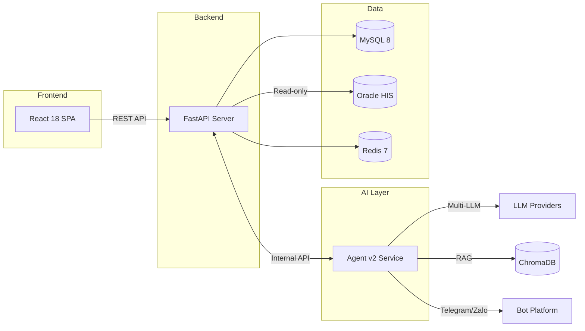
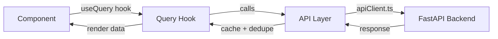
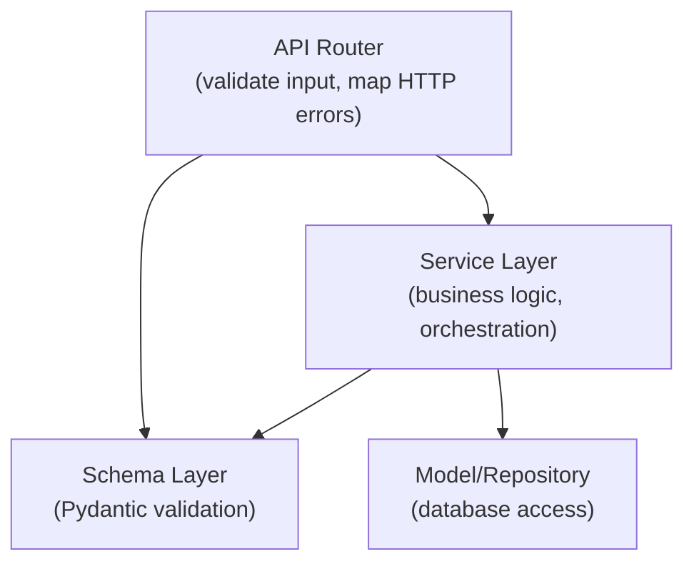
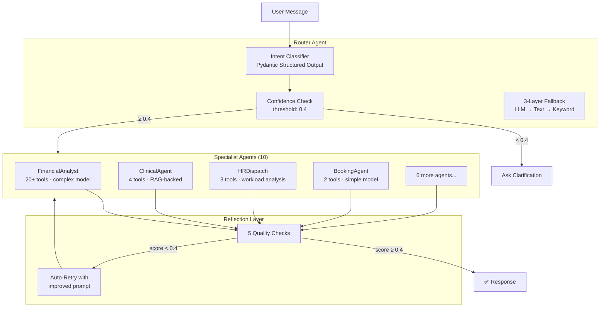
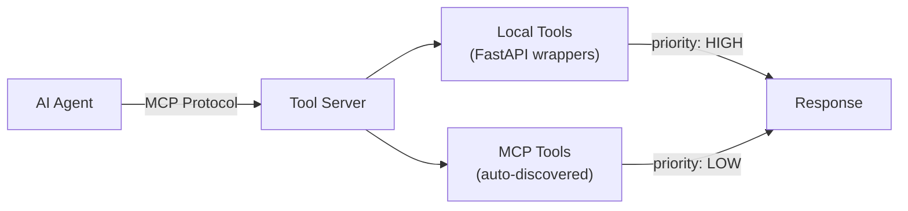
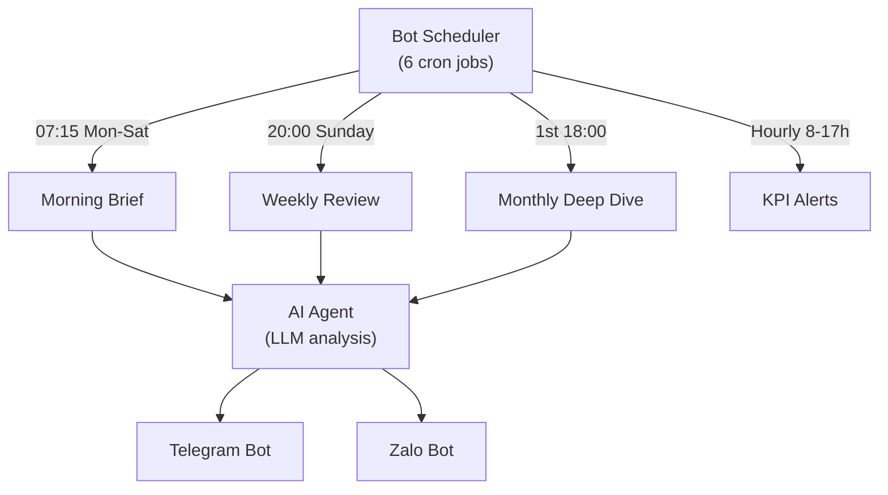

# 🏗️ Architecture Documentation

> Detailed system architecture for HISDashboard — an AI-powered Hospital Management System.

---

## 1. System Overview

HISDashboard is composed of 4 major subsystems:



---

## 2. Frontend Architecture

```
hospital-dashboard/src/
├── api/              ← 28 API client files (domain-organized)
├── hooks/queries/    ← 25 TanStack Query hooks
├── features/         ← 12 page-level feature modules
├── components/       ← Shared UI components
├── stores/           ← Zustand state management
├── services/         ← apiClient.ts (single HTTP client)
├── theme/            ← Ant Design theme configuration
├── types/            ← TypeScript type definitions
└── utils/            ← Pure utility functions
```

### Key Patterns

| Pattern | Implementation |
|---|---|
| **API Layer** | Domain-organized files (`hrApi.ts`, `reportsApi.ts`) — components never call HTTP directly |
| **Server State** | TanStack Query with stable keys, `staleTime`, `retry`, `enabled` |
| **Client State** | Zustand — minimal stores for UI-only state |
| **Design System** | CSS variables + Ant Design tokens + Tailwind utilities (documented in DESIGN.md) |
| **Code Splitting** | Lazy-loaded feature modules for chart/export heavy components |
| **Responsive** | Mobile-first with compact layout below 767px |

### Data Flow



---

## 3. Backend Architecture

```
backend/app/
├── api/v1/           ← 37 API routers (thin: validate → service → respond)
├── services/         ← 33 core services + 11 report sub-services
├── models/           ← 31 SQLAlchemy ORM models
├── schemas/          ← Pydantic request/response schemas
├── core/             ← Config, Security, Scheduler, Logging
├── database/         ← MySQL + Oracle connection adapters
└── middleware/       ← CORS, ActivityTracker, CorrelationId
```

### Layered Architecture



### Database Strategy

| Database | Role | Access Pattern |
|---|---|---|
| **MySQL 8** | Application state — users, configs, logs, schedules | Full CRUD via SQLAlchemy ORM |
| **Oracle 11g** | Hospital core data — patients, billing, departments | **Read-only** via raw SQL with bind variables |
| **Redis 7** | Cache layer — session, query results, rate limiting | Key-value with TTL |

### Data Sync Pipeline

```
Oracle HIS (source of truth)
    ↓ (Nightly at 01:00)
    ↓ Daily Sync — 1 month billing window
    ↓ (Weekly at 02:00 Sunday)
    ↓ Weekly Sync — 3 month billing window
    ↓
MySQL (app state) — pre-computed for fast dashboard queries
    ↓
Redis (cache) — warmup every 30 min during business hours
    ↓
Frontend Dashboard — loads < 1 second
```

---

## 4. AI Agent Architecture



### Agent Configuration Strategy

| Agent | Model | Tools | Max Iterations | Parallel |
|---|---|---|---|---|
| FinancialAnalyst | Complex (GPT-4 class) | 20+ | 10 | ✅ |
| ClinicalAgent | Complex | 4 (RAG) | 5 | ❌ |
| StrategicPlanner | Complex | 4 | 8 | ❌ |
| HRDispatch | Complex | 3 | 6 | ✅ |
| BookingAgent | Simple (GPT-3.5 class) | 2 | 3 | ❌ |
| ReminderAgent | Simple | 1 | 3 | ❌ |
| GeneralAssistant | Simple | 2 | 3 | ❌ |

**Cost optimization**: Simple agents use cheap models → ~60% cost reduction vs all-complex.

---

## 5. MCP Integration



The hybrid toolkit approach:
1. **Local tools** — REST wrappers calling our FastAPI backend (fast, battle-tested)
2. **MCP tools** — Discovered at runtime from MCP server (extensible, no code changes)
3. **Priority system** — Local tools always take precedence

---

## 6. Bot Platform



---

## 7. Security Model

| Layer | Mechanism |
|---|---|
| **Authentication** | JWT tokens (HS256), refresh token rotation |
| **Authorization** | RBAC with 3 roles: admin, editor, viewer |
| **API Security** | Rate limiting, CORS whitelist, input validation (Pydantic) |
| **Database** | Parameterized queries (no string concatenation), Oracle read-only |
| **AI Safety** | Reflection layer catches ungrounded medical claims |
| **Infrastructure** | Cloudflare Tunnel (no exposed ports), Docker network isolation |
| **Audit** | Activity tracker middleware logs all state-changing operations |

---

## 8. Infrastructure

```yaml
# Docker Compose — 6 Services
services:
  mysql:       # App database
  redis:       # Cache layer
  backend:     # FastAPI server
  aiagent:     # AI Agent service
  frontend:    # React SPA (Nginx)
  cloudflared: # Cloudflare Tunnel
```

All services use health checks and restart policies for production reliability.
